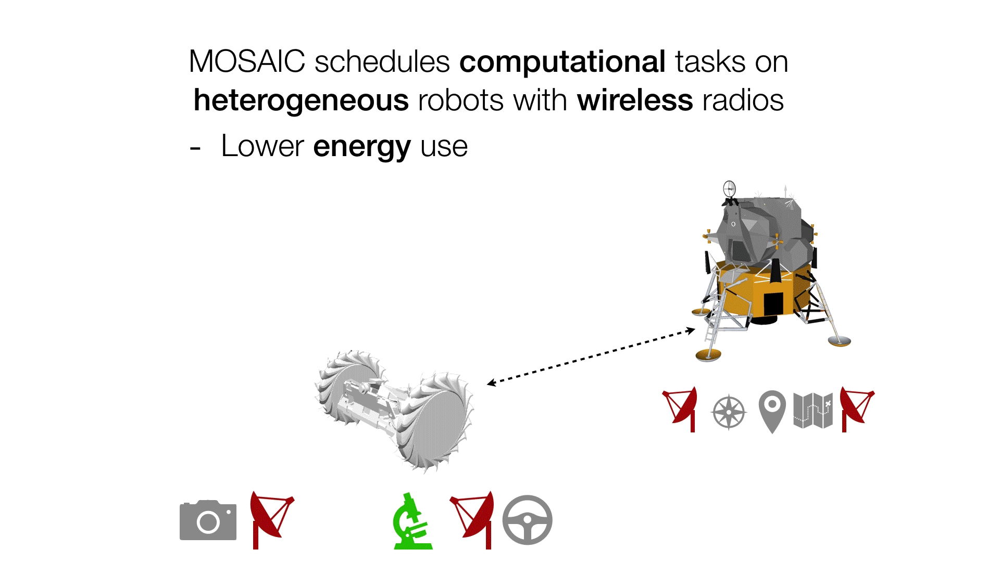
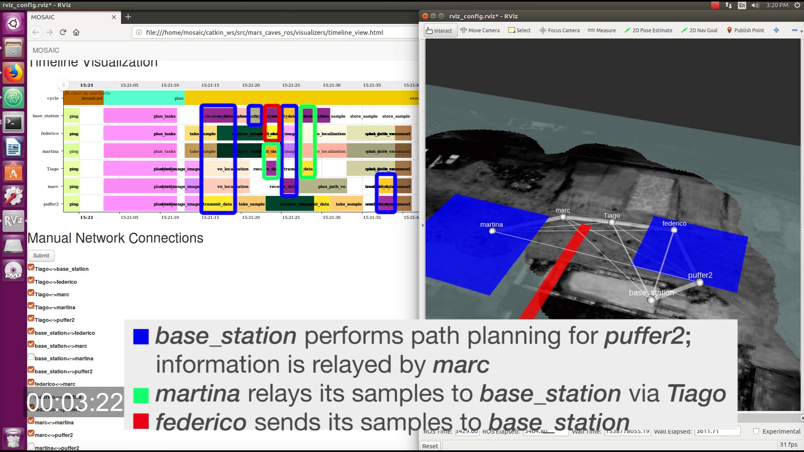

# MOSAIC: Mars On Site Shared Analytics, Information, and Computing

This repository contains MOSAIC schedulers and the Pluggable Distributed Resource Allocator (PDRA).

Together, the tools in this repository enable heterogeneous multi-robot systems to share computational tasks with complex dependencies among agents with heterogeneous computation capabilities over time-varying communication links.

Maintainers:

- [Federico Rossi](https://github.com/federico3) `federico.rossi@jpl.nasa.gov`
- [Tiago Stegun Vaquero](https://github.com/tvaquero) `tiago.stegun.vaquero@jpl.nasa.gov`
- [Marc Sanchez Net](https://github.com/msancheznet) `marc.sanchez.net@jpl.nasa.gov`
- [Joshua Vander Hook](https://github.com/jodavaho/) `hook@jpl.nasa.gov`

## [MOSAIC schedulers](schedulers)

We propose scheduling and task-allocation algorithms to share computational tasks among heterogeneous agents over time-varying communication links.

Specifically, we propose:

- A mixed-integer programming algorithm for scheduling tasks in heterogeneous robotic networks with time-varying communication links. The scheduler can accommodate any non-cyclical dependencies between tasks and arbitrary time-varying communication links, handle optional tasks with associated rewards, and optimize cost functions including rewards for optional tasks, makespan, and energy usage. The scheduler is presented in \[1\].

- A mixed-integer programming algorithm for task allocation in  heterogeneous robotic networks with *periodic* communication links. The task allocation algorithm also accommodates any non-cyclical dependencies between tasks and handles optional tasks with associated rewards and maximum latency requirements; it can maximize reward from optional tasks or minimize energy use. The task allocation algorithm is presented in \[2\].

<!--  -->

## [Pluggable Distributed Resource Allocator](distributed_resource_allocator)

The Pluggable Distributed Resource Allocator (PDRA) is a middleware for distributed computing in heterogeneous mobile robotic networks. It allows the MOSAIC schedulers to be easily "plugged" in existing autonomy executives with minimal software changes. PDRA sits between an existing single-agent planner/executor and existing computational resources (e.g. ROS packages). It intercepts the executor’s requests and, if needed, transparently routes them to other nodes for execution.
Simulation results show that PDRA can reduce energy and CPU usage by over 50\% in representative multi-robot scenarios compared to a naive scheduler; runs on embedded platforms; and performs well in delay- and disruption-tolerant networks (DTNs). PDRA is available to the community under an open-source license.

<!--  -->

## Installation and Usage

Detailed documentation is available at [`nasa.github.io/MOSAIC`](https://nasa.github.io/MOSAIC/).

## References

\[1\] Joshua Vander Hook, Tiago Vaquero, Federico Rossi, Martina Troesch, Marc Sanchez Net, Joshua Schoolcraft, Jean-Pierre de la Croix, and Steve Chien, ["Mars On-Site Shared Analytics Information and Computing,"](https://aaai.org/ojs/index.php/ICAPS/article/view/3556) in Proceedings of the Twenty-Ninth International Conference on Automated Planning and Scheduling, vol. 29, no. 1, pp. 707-715, July 2019.

\[2\] Federico Rossi\*, Tiago Stegun Vaquero\*, Marc Sanchez Net, Maíra Saboia da Silva, and Joshua Vander Hook, ["The Pluggable Distributed Resource Allocator (PDRA):a Middleware for Distributed Computing in Mobile Robotic Networks"](https://arxiv.org/abs/2003.13813), under review.

## Copyright

Copyright 2019 by California Institute of Technology.  ALL RIGHTS RESERVED.
United  States  Government  sponsorship  acknowledged.   Any commercial use
must   be  negotiated  with  the  Office  of  Technology  Transfer  at  the
California Institute of Technology.

This software may be subject to  U.S. export control laws  and regulations.
By accepting this document,  the user agrees to comply  with all applicable
U.S. export laws and regulations.  User  has the responsibility  to  obtain
export  licenses,  or  other  export  authority  as may be required  before
exporting  such  information  to  foreign  countries or providing access to
foreign persons.

This  software  is a copy  and  may not be current.  The latest  version is
maintained by and may be obtained from the Mobility  and  Robotics  Sytstem
Section (347) at the Jet  Propulsion  Laboratory.   Suggestions and patches
are welcome and should be sent to the software's maintainer.
