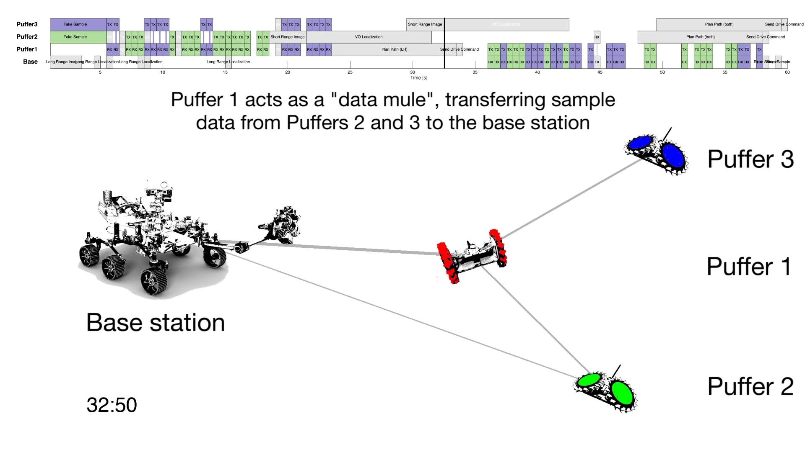

# MOSAIC: Mars On Site Shared Analytics, Information, and Computing



This repository contains MOSAIC schedulers and usage examples.

Maintainers: 

- Federico Rossi `federico.rossi@jpl.nasa.gov`
- Tiago Stegun Vaquero `tiago.stegun.vaquero@jpl.nasa.gov`


## Requirements

### Libraries

The scheduler depends on the [GLPK](https://www.gnu.org/software/glpk/) (MI)LP solver.
GLPK and its dependencies can be installed by running `ubuntu_requirements.sh` (on Debian and derivatives, including Ubuntu) or `fedora_requirements.sh` (on Fedora and derivatives, including CentOS). This will also install some of the requirements to compile the SCIP solver from source (see below).

If available, the scheduler can also make use of the following commercial solvers, which both offer academic licensing options:
- [SCIP](https://scip.zib.de)
- [CPLEX](https://www.ibm.com/products/ilog-cplex-optimization-studio)

SCIP provides [RPM and Deb binaries](https://scip.zib.de/index.php#download) for x86. On ARM, we recommend compiling from source. Place the SCIP source code in a folder (e.g., `scipoptsuite-6.0.1`), and then run:
```
cd scipoptsuite-6.0.1
mkdir build
cd build
cmake ..
make
make install
```

If CPLEX is not available, the solvers will fall back to GLPK.
An academic license for CPLEX can be obtained from [IBM](https://www-03.ibm.com/isc/esd/dswdown/searchPartNumber.wss?partNumber=CJ4Z5ML) after registering for the [IBM Academic Initiative](https://my15.digitalexperience.ibm.com/b73a5759-c6a6-4033-ab6b-d9d4f9a6d65b/dxsites/151914d1-03d2-48fe-97d9-d21166848e65/home). Using the academic license is acceptable for non-commercial research: specifically, _"Noncommercial research purposes are defined as conducting not-for-profit research projects whose results would be considered to be in the public domain and suitable for submission to a peer-reviewed journal or conference for publication. IBM Products may be used in noncommercial research that is focused on the business concepts, science, math or technology upon which the product is based."_ (per the [IBM Academic Initiative Software Usage guidelines](https://my15.digitalexperience.ibm.com/b73a5759-c6a6-4033-ab6b-d9d4f9a6d65b/dxsites/151914d1-03d2-48fe-97d9-d21166848e65/faqs/guidelines)).

### Python dependencies.

Python dependencies can be installed by running the script `pip_requirements.sh`.

## Installation

```python
pip install .
```

## Usage

See the `README`s of specific schedulers ([time-varying MILP](mosaic_schedulers/schedulers/tv_milp/README.md), [HEFT](mosaic_schedulers/schedulers/heft/README.md)) for a description of the I/O format.

### Examples

Usage examples and sample problems for the schedulers are contained in the [examples](examples/) folder in this repository.
In particular, the [`example_scenarios`](examples/example_scenarios.ipynb) Jupyter notebook shows some interesting examples of cooperative behavior on a simple PUFFER-inspired problem.

### Common tools

Several plotting tools are available. They can be imported as `import mosaic_schedulers.common.plotting`.

## Copyright

Copyright 2019 by California Institute of Technology.  ALL RIGHTS RESERVED.
United  States  Government  sponsorship  acknowledged.   Any commercial use
must   be  negotiated  with  the  Office  of  Technology  Transfer  at  the
California Institute of Technology.

This software may be subject to  U.S. export control laws  and regulations.
By accepting this document,  the user agrees to comply  with all applicable
U.S. export laws and regulations.  User  has the responsibility  to  obtain
export  licenses,  or  other  export  authority  as may be required  before
exporting  such  information  to  foreign  countries or providing access to
foreign persons.

This  software  is a copy  and  may not be current.  The latest  version is
maintained by and may be obtained from the Mobility  and  Robotics  Sytstem
Section (347) at the Jet  Propulsion  Laboratory.   Suggestions and patches
are welcome and should be sent to the software's maintainer.
