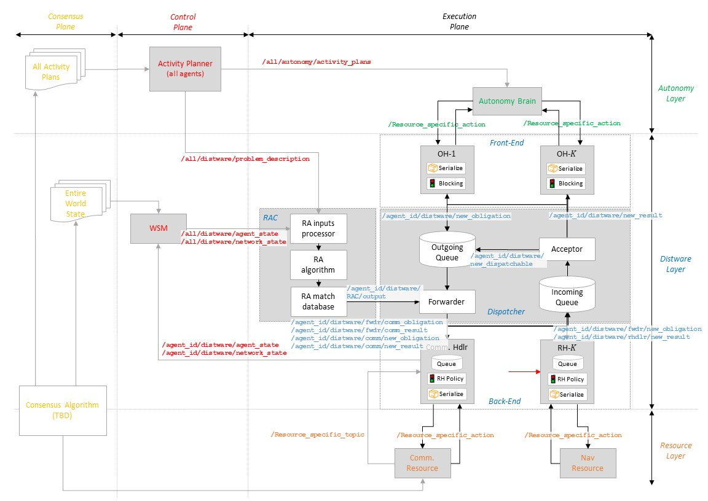

**Pluggable Distributed Resource Allocator (PDRA)**
===================================================

# Background

Traditional monolithic autonomous systems typically have a layered architecture that includes:

1) **Autonomy Layer**: Represents the "brain" of the robot/mission. It is designed and implemented by each mission based on its specific needs (with a certain amount of legacy code in general).
2) **Middleware Layer**: Allows different parts of the autonomy layer to interact with each other and with other elements in robot. Ideally, it is provided by a COTS or COTS-like library (e.g. ROS Pub/Sub, DTN's AMS)
3) **Networking Layers**: Set of protocols that enable the middleware layer to communicate with another entity with a certian level of service (e.g., reliable and in-order transfer for TCP, unreliable transfer for UDP).

To improve the performance of monolithic autonomous systems, a well-known alternative is to distribute resources among multiple potentially heterogeneous systems. Each of them will perform part or all of the tasks required for mission success, as well as outsource some others to its peers. Furthermore, a robot will also contribute to its peer's success by performing some of their tasks. 

Clearly, this approach only works if there is a certain level of coordination among peers in the distributed system. To achieve this, three competing approaches are possible:

*Centrally Controlled Distributed System*

Knowledege about the state of the distributed system is provided to a central entity that then decides both the tasks that each mission must perform and how to allocate them among the different resources available in the system. Note that this approach maximizes system performance as long as a single "God-like" entity is making decisions with perfect (instantenous) information. However, both the problem of ensuring perfect information at any point in time, and the complexity of scheduling both which tasks to perform and where to do so  render this approach technically chanllenging to achieve when tasks exhibit dependencies. Therefore, it is typically used in the literature as a way to set upper bounds on system performance that can then be used as benchmarks (rather than in an operational context).

*Single-Layer Distributed System*

Knowledege about the state of the distributed system is proveided directly to each mission's autonomy layer. Given this input, and its own requirements, the mission decide which tasks to execute and where to perform them (either locally or outsourced to a peer). Note that this approach can potentially match the performance of a centrally controlled distributed system assuming perfect information across the distributed system and unlimited resources for each mission. This is because, once again, the autonomy layer is charged with making decisions on both what to do and where to do them. Furtheremore, if the state information provided to each mission's autonomy layer do not match, then performance degrades faster than in centrally controlled distributed systems.

*Multi-layer Distributed System*

In this type of system a new layer in the protocol stack is added to each robot:
1) **Autonomy Layer**: It decides which tasks need to be performed (and when to do them?)
2) **Distware[1](#foot1) Layer**: Given a task that needs to be performed, it decides whether this task will be implemented locally or remotely.
3) **Middleware Layer**: Same as before, it enables the distware layer by facilitating messaage exchange within and accross robots.
4) **Networking Layers**: Same as before, it enables the middleware layer.

By separating the autonomy and distware layers, both problems can be solved indepedently and therefore with less complex algorithms. However, decoupling them also generally incurs in a performance penalty, as the autonomy layer will never have perfect information to make its decisions. Finally, note that using a multi-layer distributed system is almost always the preferable alternative for systems with large portions of legacy code. Indeed, for these types of systems the autonomy layer is typically well-defined and mature. Therefore, it is undesirable to change it to accommotdate the needs to of running tasks over a distributed set of resources.

# Generic System Goals

The goal of this subproject is to enable other missions to design, implement and operated multi-layer distributed systems by prototyping a distware layer using ROS. This distware layer, termed Pluggable Distributed Resource Allocator (PDRA) will be:

- Pluggable, i.e., it can be inserted underneath of an autonomy layer with minimal coding rework.
- Distributed, i.e. it will manage the allocation of tasks to local and remote resources with minial support from the autonomy layer.
- Extensible, i.e., it can be easily modified by the implementer of the autonomy layer to support distributing tasks other than the pre-defined ones.

# Definitions and Reserved Terms

Next, we provide a set of definitions intended to normalize nomenclature in PDRA and minimize ambiguity. Then, we indicate terms that should preferably be left unused as they have caused confusion in the past.

*Definitions*

- **Agent**: Any robotic or non-robotic entity capable of requesting, performing and potentially planning activities.

- **Activity**: Set of functions and/or actions that need to be performed by an agent to achieve mission success. Prior to its satisfaction, an activity is said to be in *pending state*. Afterwards, it is said to be in a *completed state*.

- **Activity Plan**: Set of activities, normally organized in a time-based fashion, that specify how an agent is operated. Activity plans are generated by either a central agent (e.g., a team of planners at JPL), or by each agent independently. Additionally, activity plans can be created solely by humans, using a mix of autonomy and human inputs, or by having an software autonomy layer.

- **Activity Planner**: Agent that creates the activity plan for one or multiple agents (including or excluding itself).

- **Demand**: Quantity of resources consumed by an activity when transitioning from a pending to a completed state.

- **Resource**: Physical/informational/energetical assets available in an agent to perform activities (both its own and on behalf of others).

- **Obligation**: Data product to encapsulate an activity whose execution needs to be allocated and dispatched through the distware system. Obligations must include at least the following data fields:

    - Obligation identifier (typically a combination of a timestamp and the node identifier).
    - Activity identifier, type and demand.
    - Priority level.
    - Expiration time.

    Additionally, other information in a obligation might include activity dependencies, metadata on how to process the activity and its dependent tasks, etc. Finally, obligations that refer to an activity that depends on another activity are referred to as *dependent obligations*.

- **Result**: Data product to encapsulate the results of having processed and obligation and performed its related activity. Results must include at least the following data fields:

    - Result identifier (typically a combination of a timestamp and the node identifier).
    - Obligation identifier for the obligation that generated this result.
    - Activity Result.

- **Report**: Data product to encapsulate control or management information required by any component in the distware to correctly perform its functionality.

*Reserved Terms*

- **Task**: It can refer to both an activity or a obligation, depending on the context.
- **Scheduler**: It can refer to both the activity planner or the RAC, depending on the context.
- **Message**: It can refer to either an activity, a obligation or a report, depeding on the context.
- **Packet**: Typically used in the context of the networking layers.
- **Frame**: Typically used in the context of the networking layers.
- **Request**: It can refer to an obligation or a ROS service/action request.
- **TBD**

*PDRA Scope*

At present, the scope of the PDRA is restricted by the following set constraints:

1) Any functionality required for an agent to create, input or process an activity plan is not considered part of PDRA. In other words, from the distware's point of view, activity plans are generated by a quiescent agent and made available to the agent magically.
2) This quiescent agent can optionally request information about the PDRA resources' state for its task planning procedures.
3) PDRA's dispatcher will not chain execution of dependent obligations in neither local nor remote agents. This feature might be explored in the future, but it is known to significantly increase complexity (e.g., a mechanism to avoid obligation loops is required).
4) The ability to interface with PDRA in a blocking/non-blocking manner (i.e. service vs. action in ROS) is an implementation specific problem and is therefore not prescribed in the system architecture definition. However, both interaction types should be applicable.

# Specific System Goals

The goal of this subproject is to prototype a distware layer to enable distributed computing and, more generally, distributed resource allocation, for existing and new autonomy layers using ROS by

- Exposing a ROS-like interface to the autonomy layer.
- Providing default (de)serialization mechanisms to minimize re-definition of ROS message and service types.
- Providing (de)serialization hooks to let agents work with their own ROS message/services types.
- Automatically and internally performing all control and management functions for all modules in the distware layer
- Automatically and internally allocating activities to either local or remote resources.
- Automatically and internally dispatching or canceling obligations, results and reports as needed.
- Providing results to the autonomy layer on the status of its currently managed obligations and underlying resources upon request or at regular intervals (TBR).
- Providing the autonomy layer with the set of feasible tasks given the state of the distributed resources upon request or at regular intervals (TBR).

# System Architecture

The system architecture details the primary components that need to be implemented for the PDRA protoype, as well as the information flows between them. It is broken down into the *execution plane*, which shows how obligations and results are handled in the system; the *control plane*, which focuses on how reports are disseminated through the distware; and the *consensus plane*, which ensures that all global information in the system is available at each agent in a synchronized manner (at least ideally). Also, for the purposes of the diagrams below, it is assumed that a single agent is developing the activity plan for everyone. This is not a constraints but rather a way to facilitate the system's visual representation.

*Component Definitions*

- **Resource-Allocation matCher (RAC)**: Process that decides the best agent to perform the activity associated with a certain obligation given a known activity plan, and a set of agents with known available resources. This process can be executed in real-time as new activities arrive or resources change; or can be triggered at repeated time intervals and the resulting allocation kept constant for the duration of that time interval.

- **Dispatcher (DPT)**: Process that, given a set of obligations and results, sends them to the necessary agent and resource (either local or remote) to perform (in response to) their associated activities.

- **Forwarder (FWR)**: Process that pulls obligations or results from the *outgoing queue* and decides how to process them. For obligations, the RAC is called to see which agent and which resource should process it. For results, it directs them to the communications subsystem to be sent back to the agent that issued the obligation.

- **Acceptor (ACR)**: Process that pulls obligations or requests from the *incoming queue* and decides how to process them. For obligations, they are immediately put in the *outgoing queue* so that the forwarder can proccess them. For results, two options are possible: A remote result (i.e., created as a response to a remote obligation) is delivered to the *outgoing queue* for further processing. Alternatively, a result for this agent is delivered to the upper layer through the RHR.

- **Obligation Handler (OH-x)**: Process to keep track of the set of activities requested by an agent and their obligations. It at least provides the following functionality: Serialize an activity into an obligation; deserialize a result in an activity result; provide a blocking/non-blocking mechanism depending on whether how the user wants to execute the activity. One obligation handler must be defined for each type of activity that PDRA needs to recognize as distributable.

- **Resource Handler (RH-x)**" Process to make requests and collect results from system resources. It at least provides the following functionality: Queue for all obligations for a given resource; deserialize an obligation to a resource request type; serialize a resource response type into a result; provide a blocking mechanism to avoid resource preemption. One resource handler must be defined for each type of activity that PDRA needs to recognize as distributable.

- **World State Monitor (WSM)**: Process that monitors and updates the state of resources for all agents in the distributed system and deliver it to the RAC. It typically interfaces with one or multiple processes, all part of the consensus plane.

- **Activity Planner (APR)**: Process that monitors and updates the activity plans for all agents in the distributed system and deliver it to the RAC. It typically interfaces with one or multiple processes, all part of the consensus plane.

Each of these components should be implemented as one or multiple ROS nodes communicating via ROS' Pub/Sub mechanism. Also, both the *incoming and outgoing queues* should be implemented using a FIFO policy with priorities.

*Execution and Control Planes*

The following <a href="images/System_Architecture.pdf">image</a> shows a high-level structure of the PDRA, its components and how they exchange information. At the core of the distware layer is the dispatcher with an *outgoing* and *incoming queue*. Obligations and results are enqueued in either of them depending on whether they are awaiting to be processed or they are the result of processing by an agent's resource (not necessarily the local agent). Importantly, obligations and results arriving at an agent can be send directly to the *outgoing queue* without being delivered to the upper layer. This ensures that obligations arriving from a remote node can be directed to the appropriate resources transparently.

# Implementation Description

ROS will be used to implement a first version of PDRA. Next, we briefly describe the test case assumed for development purposes decompose the system into the different ROS nodes, messages, services and actions required. Additionally, we also state the implementation limitations that have been identified but not addressed presently. Finally, we also briefly introduce and motivate the repository structure, and mention possible adaptations from past MOSAIC efforts such as the *ROS Service Manager*.

*Development Test Case*

The test case for PDRA development purposes will contain 10 nodes in total encompassing the autonomy, distware and resource layer. It will include two nodes, notionally called Puffer and Base Station, each one having two resources, communications and navigation.

In a first step, the test will be instantiated with a single agent (e.g., the Puffer). Its goal will be to demonstrate that all interfaces in the ROS system are working as expected, and activities are being allocated to local resources (i.e., within the Puffer itself) seamlessly. Additionally, the serialization/deseralization mechanisms, as well as the blocking/non-blocking semaphores will also be tested.

Once step one has been completed, a second agent (the Base Station) will be introduced in the system. In this case, the goal of the testing procedures will be to ensure that all nav puffer activities are offloaded to the Base Station.

*Naming Conventions*

The following naming conventions will be used to define PDRA ROS signatures[2](#foot2):

- Signatures applicable to all agents will be prefaced by ``/all/signature_path``.
- Signatures applicable to a given agent will be prefaced by ``/agent_id/signature_path``.
- Signatures applicable to a specific layer will be prefaced by ``xxx/layer_id/signature_path``.
- Signatures applicable to a specific (layer, module) pair will be prefaced by ``xxx/layer_id/module_id/signature_path``.

For instance, the topic that distributes the activity plans for all agents should be named ``/all/autonomy/activity_plans``. However, if a topic was only applicable to a single agent, then its name should be ``/puffer1/autonomy/activity_plan``. This convention will be enforced using namespacing in the ROS *launch* files.

*ROS System Implementation*

NOTE: Gray shaded boxes represent a single ROS node. Sub-boxes contained within them are Python functions (or similar) within the ROS node.

*Python Classes*

The core of PDRA is implemented using two classes, an obligation and a result. They both inherit from a *dispatchable* interface as show in the following diagram.

*ROS Node Specification*

The test case for PDRA development purposes will contain the following ROS nodes:
    
- Autonomy Layer:
    - Autonomy Brain: ROS node that, given a set of sequential activities, it loops through them and executes them one at a time. The set of activities to execute will be provided by the topic ``/all/autonomy/activity_plans`` encoded in a JSON format.
    - Activity Planner: ROS node that reads from a file the set of activities to be performed by all agents, encodes them as a JSON dictionary and publishes them in the topic ``/all/autonomy/activity_plans``.
- Distware Layer:
    - Front-End:
        - Generic obligation handler providing common functionality such as blocking semaphores and obligation timout mechanisms. It is intended to be an abstract node that needs to be subclassed.
        - Test-specific communication handler. It subclasses the generic obligation handler, converts a ``comm.action`` into a serialized obligation, and publishes it in ``/agent_id/distware/new_obligation``. The result of the action is published, when available, to ``/agent_id/distware/new_result``.
        - Test-specific navigation handler. Idem with ``nav.action``.
    - RAC: ROS node that, given the activity plans for all users and the state of the world and network, computes the match/allocation between the pair (resource, agent) and each activity type. To get its inputs, the RAC listens to the topics ``/all/autonomy/activity_plans``, ``/all/distware/agents_state`` and ``/all/distware/network_state``. At regular time intervals (e.g. 1 minute), the RAC recomputes the RA matching. Finally, the RAC publishes the compuited RA match also at regular time intervals (e.g. 1 second) using the topic ``/agent_id/distware/RAC/output``.
    - Dispatcher: ROS node that contains both the forwarder and the acceptor (as previously defined). They listen to ``/agent_id/distware/new_obligation`` and ``/agent_id/distware/new_dispatchable`` respectively, and publish to ``/agent_id/distware/fwdr/new_obligation``, ``agent_id/distware/fwdr/comm_obligation`` ``/agent_id/distware/fwdr/comm_result``.
    - Back-end:
        - Generic resource handler providing common functionality. It is intended to be an abstract node that needs to be subclassed. Any resource handler will interact with the underlying resource in a blocking fashion to avoid overloading it, even if this interaction occurs physically through a non-blocking mechanism such as a ROS action. Therefore, the generic RH should provide its own blocking mechanism. Also, different policies for how to handle resource preemption might be desired by the user as a function of the type of obligation under consideration (e.g., local obligations preempt, but remote obligations do not). Therefore, a generic policy mechanism to handle these constraints should also be included.
        - Test-specific communication handler. It subclasses the generic resource handler, and awaits for a new obligation or result to process from ``/agent_id/distware/fwdr/comm_obligation`` and ``/agent_id/distware/fwdr/comm_result``. Then, it converts the dispatchable into a ``comm.action``, triggers the request and, if necessary, awaits for the response. Any remote obligation or result is published to ``/agent_id/distware/comm/new_obligation`` and ``/agent_id/distware/comm/new_result`` respectively.
        - Test-specific navigation handler. Idem with ``nav.action``, except that obligations are arrive through the ``agent_id/distware/fwdr/new_obligation`` topic and their responses are published to ``agent_id/distware/rhdlr/new_result``.
- Resource Layer:
    - Communications: ROS node that receives a request via ``comm.action``, publishes the message in ``/destination_agent/resource/comm``, sleeps for a while to simulate the transmission time, and returns.
    - Science: ROS node that receives a request via ``nav.action``, sleeps for a while to simulat the transmission time, and returns.

*ROS Signature Specification*

The test case for PDRA development purposes will contain the following ROS signatures:

- ROS messages (topics):
    - ``/all/autonomy/activity_plans``: A ROS ``std_msgs.msg.String`` with the activity plan for all agents encoded in JSON.
    - ``/all/autonomy/agents_state``: A ROS ``std_msgs.msg.String`` with the state of all agents encoded in JSON.
    - ``/all/autonomy/network_state``: A ROS ``std_msgs.msg.String`` with the state of the network between agents encoded in JSON.
    - ``/agent_id/distware/new_obligation``: A ROS ``std_msgs.msg.String`` with an obligation encoded in JSON.
    - ``/agent_id/distware/new_result``: A ROS ``std_msgs.msg.String`` with a result encoded in JSON.
    - ``/agent_id/distware/new_dispatchable``: A ROS ``std_msgs.msg.String`` with either an obligation or result encoded in JSON.
    - ``/agent_id/distware/RAC/output``: A ROS ``std_msgs.msg.String`` with the RAC output encoded in JSON.
    - ``/agent_id/distware/fwdr/new_obligation``: A ROS ``std_msgs.msg.String`` with an obligation encoded in JSON.
    - ``/agent_id/distware/fwdr/comm_obligation``: A ROS ``std_msgs.msg.String`` with a result encoded in JSON.
    - ``/agent_id/distware/fwdr/comm_result``: A ROS ``std_msgs.msg.String`` with a result encoded in JSON.
    - ``/agent_id/distware/comm/new_obligation``: A ROS ``std_msgs.msg.String`` with an obligation encoded in JSON.
    - ``/agent_id/distware/comm/new_result``: A ROS ``std_msgs.msg.String`` with a result encoded in JSON.
    - ``/agent_id/distware/hdlrd/new_result``: A ROS ``std_msgs.msg.String`` with a result encoded in JSON.
- ROS services:
    - N/A
- ROS Actions:
    - ``comm.action``
    - ``nav.action``

Note that the communications resource handler is implemented slightly differently from all other resource handlers. In particular, it interfaces with the dispatcher using 4 topics, two to send obligations and results to through the comm. subsystem, and another two to remote obligations and results through it. In contrast, all other resources only receive obligations and respond with results. Therefore, only two topics are needed.

*Known Limitations*

The current implementation of PDRA assumes that both the autonomy layer and the resource layer interact with the distware layer through ROS actions exclusively. This is so due to legacy considerations, namely MOSAIC's codebase used actions to interace the autonomy and resource layers originally.

While ROS actions provide a non-blocking mechanism to request an action from another ROS node, they are known to internally implement a preemption mechanism that limits how PDRA can accept obligations from the autonomy brain. Specifically, if the autonomy system requests two comm actions 1 second apart, but the time to execute a comm action is 10 seconds, then the first request will be preempted and therefore lost. Note that this problem will not happen if one of the requests came from another agent, since PDRA's back-end will include a blocking mechanism to avoid preemption (i.e. it will effectively make calls to resources in a ROS service-like fashion, blocking excution, even if the interface with the resource is a ROS action).

*Repository Structure*

PDRA's code will be stored in two separate packages:

- `pdra`: Contains all core ROS nodes and signatures for the distware layer. Specifically, it includes:
    - Generic front-end node
    - RAC
    - Dispatcher
    - Generic back-end node
    - Definition for message types ``/agent_id/distware/new_obligation``, ``/agent_id/distware/new_result``, ``/agent_id/distware/ra_match``, ``/agent_id/distware/resource_obligation``, ``/agent_id/distware/resource_result``
    - Launch file to put together a PDRA system
- `tests`: Contains all ROS nodes and messages required for the test case to work. It includes:
    - Action-specific front-end nodes
    - Action-specific back-end nodes
    - All resource nodes.
    - Autonomy Brain
    - Activity Planner
    - World State Monior

# Motivating Example

The following examples and first-order requirements motivate the above design choices.

The [puffer autonomous micro-rover](https://www.jpl.nasa.gov/news/news.php?feature=6782) is being designed to allow *risk-tolerant* exploration of dangerous or out-of-reach areas such as caves, craters, high slope / slip, etc. The conop is that a flagship lander or rover would deploy a handful of puffers to explore an area. They are:

1. Resource constrained, especially power
2. Communication constrained, because of 1
3. Small, low-baseline, and lack large field of view with which to build situational awareness.

As such, they are ideal candidates for multi-sensor fusion, multi-hop networks, resource-aware tasking, and collaborative motion planning. Given that those solutions often involve "more" computational resources (and therefore power), MOSAIC can be employed to intelligently relocate processing needs without requiring (but supporting) human intervention.

Our proof of life is this example: Consider a shared-world autonomy and path planning solution. We are counting up communication steps (the arrows), the cost per communication in Joules (Jc), and the cost of processing a planning solution in Joules (Jp). We consider only the collect-plan step for brevity, because the broadcast step is at most 2x more communication steps that applies to all examples.

In the above, all puffers trade data so that they can arrive at a consensus of the world and make consistent plans. This is the most robust to communication loss, ironically, since they can *estimate* the state of the world using sensor data in the absence of getting cues from their neighbors. 

Many resource-constrained robots have a supporting asset or "base station". In this case, the main parent rover probably has more resources, and can provide support. However, it still needs to know the states of all the puffers, so effort is made to pipe data back to the rover. Note, this has a *factor two reduction in total energy use*

In some cases (like the bucket-brigade shown in the last three images), it might be safer and more resource-conservative to make the PUFFER in the middle do the processing. However, this is highly dependent on the topology of the network, the costs to compute and transmit data, and the resources available on each node. This is the problem of MOSAIC: To balance computation and communication to minimize impact to the network resources. *Compared to the top, this has a factor four reduction in energy impact*.

## Autonomy support server

----------------------------
<a name="foot1">1</a>: Distware is not a common name in the literature. It comes from combining distributed+software.

<a name="foot2">2</a>: A ROS signature refers to the definition of a message, service or action (i.e. a signature is either of them).
