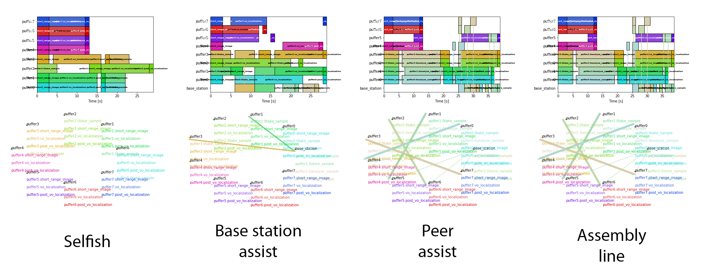

.. MOSAIC documentation master file, created by
   sphinx-quickstart on Thu May 28 16:05:05 2020.
   You can adapt this file completely to your liking, but it should at least
   contain the root `toctree` directive.

************************************************************************
MOSAIC: Multi-Agent On Site Shared Analytics, Information, and Computing
************************************************************************

.. raw:: html
   
   

   <iframe src="https://www.youtube-nocookie.com/embed/zTQ7Y4-ax2A" frameborder="0" allow="accelerometer; autoplay; encrypted-media; gyroscope; picture-in-picture" allowfullscreen style="position: absolute; top: 0; left: 0; width: 100%; height: 100%;"></iframe>
   

:Authors: 
	- Federico Rossi
	- Marc Sanchez Net
	- Tiago Stegun Vaquero
	- Martina Troesch
	- Joshua Vander Hook
:Contacts: 
	- marc.sanchez.net@jpl.nasa.gov
	- federico.rossi@jpl.nasa.gov
	- tiago.stegun.vaquero@jpl.nasa.gov
	- martina.i.troesch@jpl.nasa.gov
	- hook@jpl.nasa.gov
:Organizations:
   Jet Propulsion Laboratory, California Institute of Technology
	- Section 347, Mobility and Robotic Systems
	- Section 332, Communications Research and Architectures
	- Section 397, Planning and Execution Systems
:Address: 4800 Oak Grove Dr. Pasadena, CA 91109
:Release: |release|
:Repository: https://github.com/nasa/mosaic
:Abstract: Computational task sharing in heterogeneous multi-robot systems over time-varying communication links
:Licensing: Copyright (c) 2020, Jet Propulsion Laboratory.

.. meta::
   :keywords: Distributed Systems, Multi-agent Robotic Systems, Task Planning, Multi-robot systems, Task Allocation, Scheduling, Planning, Planning for robotics
   :description lang=en: Computational task sharing in heterogeneous multi-robot systems over time-varying communication links

This website contains documentation for the MOSAIC schedulers and the Pluggable Distributed Resource Allocator (PDRA).

Together, the tools in MOSAIC enable heterogeneous multi-robot systems
to share computational tasks with complex dependencies among agents with
heterogeneous computation capabilities over time-varying communication links.

~~~~~~~~~~~~~~~~~~~~~~~~~~~~~~~~~~~~~~
`MOSAIC schedulers <schedulers.html>`_
~~~~~~~~~~~~~~~~~~~~~~~~~~~~~~~~~~~~~~

We propose scheduling and task-allocation algorithms to share computational tasks
among heterogeneous agents over time-varying communication links.

Specifically, we propose:

- A mixed-integer programming algorithm for scheduling tasks in heterogeneous
  robotic networks with time-varying communication links. The scheduler can
  accommodate any non-cyclical dependencies between tasks and arbitrary
  time-varying communication links, handle optional tasks with associated rewards, 
  and optimize cost functions including rewards for optional tasks, makespan, 
  and energy usage. The scheduler is presented in \[1\].

- A mixed-integer programming algorithm for task allocation in  heterogeneous
  robotic networks with *periodic* communication links. The task allocation
  algorithm also accommodates any non-cyclical dependencies between tasks and
  handles optional tasks with associated rewards and maximum latency requirements; 
  it can maximize reward from optional tasks or minimize energy use. The task
  allocation algorithm is presented in \[2\].

~~~~~~~~~~~~~~~~~~~~~~~~~~~~~~~~~~~~~~~~~~~~~~~~~~~~~~~
`Pluggable Distributed Resource Allocator <pdra.html>`_
~~~~~~~~~~~~~~~~~~~~~~~~~~~~~~~~~~~~~~~~~~~~~~~~~~~~~~~

.. image:: ../images/pdra.gif
  :alt: Animation of the Pluggable Distributed Resource Allocator in action

The Pluggable Distributed Resource Allocator (PDRA) is a middleware for
distributed computing in heterogeneous mobile robotic networks. It allows the
MOSAIC schedulers to be easily "plugged" in existing autonomy executives with 
minimal software changes. PDRA sits between an existing single-agent
planner/executor and existing computational resources (e.g. ROS packages). It
intercepts the executor’s requests and, if needed, transparently routes them
to other nodes for execution.
Simulation results show that PDRA can reduce energy and CPU usage by over 50\%
in representative multi-robot scenarios compared to a naive scheduler; runs on
embedded platforms; and performs well in delay- and disruption-tolerant networks 
(DTNs). PDRA is available to the community under an open-source license.

.. raw:: html
   
   

   <iframe src="https://www.youtube-nocookie.com/embed/ufxmW0XsYDA" frameborder="0" allow="accelerometer; autoplay; encrypted-media; gyroscope; picture-in-picture" allowfullscreen style="position: absolute; top: 0; left: 0; width: 100%; height: 100%;"></iframe>
   

~~~~~~~~
Contents
~~~~~~~~

.. toctree::
   :maxdepth: 3
   
   schedulers.rst
   pdra.rst

~~~~~~~~~~
References
~~~~~~~~~~

\[1\] Joshua Vander Hook, Tiago Vaquero, Federico Rossi, Martina Troesch,
Marc Sanchez Net, Joshua Schoolcraft, Jean-Pierre de la Croix, and Steve Chien,
`"Mars On-Site Shared Analytics Information and Computing,"
<https://aaai.org/ojs/index.php/ICAPS/article/view/3556>`_
in Proceedings of the Twenty-Ninth International Conference on Automated Planning
and Scheduling, vol. 29, no. 1, pp. 707-715, July 2019.

\[2\] Federico Rossi\*, Tiago Stegun Vaquero\*, Marc Sanchez Net,
Maíra Saboia da Silva, and Joshua Vander Hook,
`"The Pluggable Distributed Resource Allocator (PDRA):a Middleware for Distributed Computing in Mobile Robotic Networks"
<https://arxiv.org/abs/2003.13813>`_, 
under review.