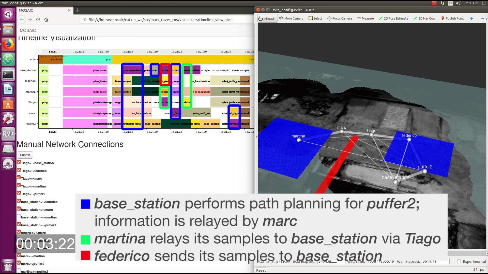

# MOSAIC schedulers



We present three+1 scheduling and task allocation algorithm for computational load sharing in heterogeneous robotic networks.

- [Time-varying MILP scheduler](schedulers/mosaic_schedulers/schedulers/tv_milp). A mixed-integer programming algorithm for scheduling tasks in heterogeneous robotic networks with time-varying communication links. The scheduler can accommodate any non-cyclical dependencies between tasks and arbitrary time-varying communication links, handle optional tasks with associated rewards, and optimize cost functions including rewards for optional tasks, makespan, and energy usage. The scheduler is presented in \[1\].

- [Task allocation algorithm for robotic networks with periodic connectivity](schedulers/mosaic_schedulers/schedulers/ti_milp). A mixed-integer programming algorithm for task allocation in  heterogeneous robotic networks with *periodic* communication links. The task allocation algorithm also accommodates any non-cyclical dependencies between tasks and handles optional tasks with associated rewards and maximum latency requirements; it can maximize reward from optional tasks or minimize energy use. The task allocation algorithm is presented in \[2\].

- A lightly modified version of the [Heterogeneous Earliest Finish Time (HEFT)](schedulers/mosaic_schedulers/schedulers/heft) algorithm. 

- A [scheduling algorithm](schedulers/mosaic_schedulers/schedulers/ti_milp_heft) that uses the proposed task allocation algorithm to assign tasks to agents, and HEFT (with fixed task allocation) to schedule task execution.

## Requirements

### Libraries

The scheduler depends on the [GLPK](https://www.gnu.org/software/glpk/) (MI)LP solver.
GLPK and its dependencies can be installed by running `ubuntu_requirements.sh` (on Debian and derivatives, including Ubuntu) or `fedora_requirements.sh` (on Fedora and derivatives, including CentOS). This will also install some of the requirements to compile the SCIP solver from source (see below).

If available, the scheduler can also make use of the following commercial solvers, which both offer academic licensing options:
- [SCIP](https://scip.zib.de)
- [CPLEX](https://www.ibm.com/products/ilog-cplex-optimization-studio)

SCIP provides [RPM and Deb binaries](https://scip.zib.de/index.php#download) for x86. On ARM, we recommend compiling from source. Place the SCIP source code in a folder (e.g., `scipoptsuite-6.0.1`), and then run:

```bash
cd scipoptsuite-6.0.1
mkdir build
cd build
cmake ..
make
make install
```

If CPLEX is not available, the solvers will fall back to GLPK.
An academic license for CPLEX can be obtained from [IBM](https://www-03.ibm.com/isc/esd/dswdown/searchPartNumber.wss?partNumber=CJ4Z5ML) after registering for the [IBM Academic Initiative](https://my15.digitalexperience.ibm.com/b73a5759-c6a6-4033-ab6b-d9d4f9a6d65b/dxsites/151914d1-03d2-48fe-97d9-d21166848e65/home). Using the academic license is acceptable for non-commercial research: specifically, _"Noncommercial research purposes are defined as conducting not-for-profit research projects whose results would be considered to be in the public domain and suitable for submission to a peer-reviewed journal or conference for publication. IBM Products may be used in noncommercial research that is focused on the business concepts, science, math or technology upon which the product is based."_ (per the [IBM Academic Initiative Software Usage guidelines](https://my15.digitalexperience.ibm.com/b73a5759-c6a6-4033-ab6b-d9d4f9a6d65b/dxsites/151914d1-03d2-48fe-97d9-d21166848e65/faqs/guidelines), retrieved on 2019-7-10).

### Python dependencies.

Python dependencies can be installed by running the script `pip_requirements.sh`.

## Installation

`pip install .`


## Docker

Dockerfiles are provided to package the MOSAIC schedulers in a Docker container. The Docker container exposes a web server that receives requests containing MOSAIC problems (in JSON format) and returns the computed schedules.

The Docker image is designed to use the SCIP scheduler and compile it from source. The SCIP source code should be placed in `docker_resources/scipoptsuite-6.0.1`. 

To build the MOSAIC docker image, run

```bash
docker build --tag=mosaic/schedulers_requirements -f Dockerfile_requirements .
docker build --tag=mosaic/schedulers -f Dockerfile .
```

When changes are made to the `mosaic_schedulers` package, only the second Docker image needs to be rebuilt.

To run the Docker image and expose the MOSAIC service on the local network,

```bash
docker run --network="host" mosaic/schedulers
```

The service exposes an instance of [MOSAIC_server.py](mosaic_schedulers/common/utilities/MOSAIC_server.py) at `localhost:4000`. The web interface accepts PUT requests containing a JSON description of the problem and returns computed schedules.


## Usage

### Examples

Usage examples and sample problems for the schedulers are contained in the [examples](../examples/) folder in this repository.
In particular, the [`example_scenarios`](../examples/example_scenarios.ipynb) Jupyter notebook shows some interesting examples of cooperative behavior on a simple PUFFER-inspired problem.

### Input format

The `JSONProblemDescription` input is a JSON dictionary containing six keys, `Tasks`, `AgentCapabilities`, `CommunicationNetwork`, `Time`, `Options`, and `Cost`.

#### Tasks attributes:

* OptionalTasks, a dict with Tasks as keys. OptionalTasks[Task] is True if
       Task is optional and False otherwise.
* TaskReward, a dict with Tasks as keys. TaskReward[Task] is the reward
      obtained for completing Task, a float.
* ProductsSize, a dict with Tasks as keys. PS[Task] is the size of the
       products of Task (in storage units), a float.
* DependencyList, a dict with Tasks as keys. DL[Task] expresses the
       pre-requisites  for each Task is conjunctive normal form. That is,
       DependencyList[Task] is a list. Each entry of the List contains a
       number of predecessor Tasks.
       For each entry in DependencyList[Task][i], at least one task.
* IncompatibleTasks, a list of lists. IT[j] is a list of
       tasks that are incompatible with each other (that is, only one can be
       executed).
* MaxLatency, a dict with keys task1, task2. MaxLatency[T1][T2] is the maximum 
       latency that the data products of T2 (a dependency of T1) can tolerate
       before they are ingested by task T1.

##### Example

```python
'{"DependencyList": {"puffer1:28. Store Sample": [["puffer1:27. Analyse Sample"]], "puffer1:27. Analyse Sample": [["puffer1:26. Take Sample"]], "puffer1:26. Take Sample": [[]], "puffer1:08. Store Sample": [["puffer1:07. Analyse Sample"]], "puffer1:2. Short Range Image": [[]], "puffer1:16. Take Sample": [[]], "puffer1:4. Plan Path (VO)": [["puffer1:3. VO Localization"]], "puffer1:3. VO Localization": [["puffer1:2. Short Range Image"]], "puffer1:07. Analyse Sample": [["puffer1:06. Take Sample"]], "puffer1:17. Analyse Sample": [["puffer1:16. Take Sample"]], "puffer1:5. Send Drive Command": [["puffer1:4. Plan Path (VO)"]], "puffer1:18. Store Sample": [["puffer1:17. Analyse Sample"]], "puffer1:06. Take Sample": [[]]}, "ProductsSize": {"puffer1:28. Store Sample": 0.1, "puffer1:27. Analyse Sample": 1, "puffer1:17. Analyse Sample": 1, "puffer1:26. Take Sample": 15, "puffer1:16. Take Sample": 15, "puffer1:2. Short Range Image": 8.0, "puffer1:08. Store Sample": 0.1, "puffer1:4. Plan Path (VO)": 0.1, "puffer1:07. Analyse Sample": 1, "puffer1:3. VO Localization": 0.1, "puffer1:5. Send Drive Command": 0.1, "puffer1:18. Store Sample": 0.1, "puffer1:06. Take Sample": 15}, "TaskReward": {"puffer1:28. Store Sample": 20, "puffer1:27. Analyse Sample": 10, "puffer1:17. Analyse Sample": 10, "puffer1:26. Take Sample": 5, "puffer1:16. Take Sample": 5, "puffer1:2. Short Range Image": 0, "puffer1:08. Store Sample": 20, "puffer1:4. Plan Path (VO)": 0, "puffer1:07. Analyse Sample": 10, "puffer1:3. VO Localization": 0, "puffer1:5. Send Drive Command": 0, "puffer1:18. Store Sample": 20, "puffer1:06. Take Sample": 5}, "MaxLatency": {"puffer1:28. Store Sample": 100.0, "puffer1:27. Analyse Sample": 100.0, "puffer1:26. Take Sample": 100.0, "puffer1:08. Store Sample": 100.0, "puffer1:2. Short Range Image": 100.0, "puffer1:16. Take Sample": 100.0, "puffer1:4. Plan Path (VO)": 100.0, "puffer1:3. VO Localization": 100.0, "puffer1:07. Analyse Sample": 100.0, "puffer1:17. Analyse Sample": 100.0, "puffer1:5. Send Drive Command": 100.0, "puffer1:18. Store Sample": 100.0, "puffer1:06. Take Sample": 100.0}, "IncompatibleTasks": [], "OptionalTasks": {"puffer1:28. Store Sample": true, "puffer1:27. Analyse Sample": true, "puffer1:17. Analyse Sample": true, "puffer1:26. Take Sample": true, "puffer1:16. Take Sample": true, "puffer1:2. Short Range Image": false, "puffer1:08. Store Sample": true, "puffer1:4. Plan Path (VO)": false, "puffer1:07. Analyse Sample": true, "puffer1:3. VO Localization": false, "puffer1:5. Send Drive Command": false, "puffer1:18. Store Sample": true, "puffer1:06. Take Sample": true}}'
```

#### AgentCapabilities attributes

* ComputationTime: a dictionary with keys Task, Agent. The value of
      CT[Task][Agent] is the time (in time steps) required for Agent to
      complete Tasks, an int.
* ComputationLoad: a dictionary with keys Task, Agent. The value of
      CT[Task][Agent] is the fraction of Agent's computational resources
      required to complete Task, a float between 0 and 1.
* EnergyCost, a dictionary with keys Task, Agent. EnergyCost[Task][Agent] is the
      energy cost when agent A computes task T.
* MaxComputationLoad, a dict with keys Agents. MaxComputationLoad[Agent] is the
      maximum computational resources of agent A.
* LinkComputationalLoadIn, a dict with keys Agent, Agent. 
      LinkComputationalLoadIn[A1][A2] is the computational load required to 
      decode messages on link [A1][A2] at A2.
* LinkComputationalLoadOut, a dict with keys Agent, Agent. 
      LinkComputationalLoadOut[A1][A2] is the computational load required to 
      encode messages on link [A1][A2] at A1.
* [Optional] InitialInformation: a dictionary with keys Task, Agent. II[Task][Agent]
      is a Bool. It is true iff Agent knows the output of Task at time t=0.
      This can be helpful to specify that only one agent can do a given task

##### Example

```python
'{"InitialInformation": {"puffer1:28. Store Sample": {"puffer1": false}, "puffer1:27. Analyse Sample": {"puffer1": false}, "puffer1:26. Take Sample": {"puffer1": false}, "puffer1:08. Store Sample": {"puffer1": false}, "puffer1:2. Short Range Image": {"puffer1": false}, "puffer1:16. Take Sample": {"puffer1": false}, "puffer1:4. Plan Path (VO)": {"puffer1": false}, "puffer1:3. VO Localization": {"puffer1": false}, "puffer1:07. Analyse Sample": {"puffer1": false}, "puffer1:17. Analyse Sample": {"puffer1": false}, "puffer1:5. Send Drive Command": {"puffer1": false}, "puffer1:18. Store Sample": {"puffer1": false}, "puffer1:06. Take Sample": {"puffer1": false}}, "EnergyCost": {"puffer1": {"puffer1:28. Store Sample": 2.0, "puffer1:27. Analyse Sample": 0.3333333333333333, "puffer1:17. Analyse Sample": 0.3333333333333333, "puffer1:26. Take Sample": 0.2, "puffer1:08. Store Sample": 2.0, "puffer1:2. Short Range Image": 0.13333333333333333, "puffer1:16. Take Sample": 0.2, "puffer1:4. Plan Path (VO)": 0.3333333333333333, "puffer1:07. Analyse Sample": 0.3333333333333333, "puffer1:3. VO Localization": 0.3333333333333333, "puffer1:5. Send Drive Command": 0.06666666666666667, "puffer1:18. Store Sample": 2.0, "puffer1:06. Take Sample": 0.2}}, "ComputationTime": {"puffer1:28. Store Sample": {"puffer1": 30}, "puffer1:27. Analyse Sample": {"puffer1": 3}, "puffer1:26. Take Sample": {"puffer1": 2}, "puffer1:08. Store Sample": {"puffer1": 30}, "puffer1:2. Short Range Image": {"puffer1": 1}, "puffer1:16. Take Sample": {"puffer1": 2}, "puffer1:4. Plan Path (VO)": {"puffer1": 3}, "puffer1:3. VO Localization": {"puffer1": 3}, "puffer1:07. Analyse Sample": {"puffer1": 3}, "puffer1:17. Analyse Sample": {"puffer1": 3}, "puffer1:5. Send Drive Command": {"puffer1": 1}, "puffer1:18. Store Sample": {"puffer1": 30}, "puffer1:06. Take Sample": {"puffer1": 2}}, "MaxComputationLoad": {"puffer1": 1.0}, "LinkComputationalLoadIn": {"puffer1": {"puffer1": 0.02}}, "ComputationLoad": {"puffer1": {"puffer1:28. Store Sample": 2.0, "puffer1:27. Analyse Sample": 0.3333333333333333, "puffer1:17. Analyse Sample": 0.3333333333333333, "puffer1:26. Take Sample": 0.2, "puffer1:08. Store Sample": 2.0, "puffer1:2. Short Range Image": 0.13333333333333333, "puffer1:16. Take Sample": 0.2, "puffer1:4. Plan Path (VO)": 0.3333333333333333, "puffer1:07. Analyse Sample": 0.3333333333333333, "puffer1:3. VO Localization": 0.3333333333333333, "puffer1:5. Send Drive Command": 0.06666666666666667, "puffer1:18. Store Sample": 2.0, "puffer1:06. Take Sample": 0.2}}, "LinkComputationalLoadOut": {"puffer1": {"puffer1": 0.02}}}'
```

#### CommunicationNetwork attributes

CommunicationNetwork is a list of dictionaries. Each dictionary has the following keys:

* origin, the name of the origin node.
* destination, the name of the destination node.
* bandwidth, the bandwidth from agent Origin to agent Destination. If the bandwidth is zero, the link is not considered in the optimization.
* time_start, the time when the communication window opens.
* time_end, the time when the communication window closes.
* latency, the light-speed latency of the link during the window. Note that the latency of a datagram is 
      computed as Latency[origin][destination]+datagram_size/bandwidth
* energy_cost, the energy cost to transmit one bit on the link.

##### Example

```python
'[{"origin": "puffer1", "latency": 0.001, "time_start": 831.2, "destination": "puffer1", "time_end": 1.7976931348623157e+308, "bandwidth": 11.0, "energy_cost": 0.0}]'
```

#### Time attributes

* Thor, the time horizon of the optimization. Ignored by time-invariant solvers.
* TimeStep, the discretization time step. Ignored by time-invariant and continuous-time solvers.

##### Example

```python
'{"Thor": 30, "TimeStep": 2 }'
```

#### Options attributes
Options is reserved for solver-specific attributes. It can be left empty.

#### Cost function

A dictionary with keys corresponding to basic cost components and entries corresponding to the weight (coefficient) given to each cost function.
The cost components are:

* energy: the energy required to complete the tasks;
* total_task_reward: the reward obtained for completing optional tasks;
* total_time: the total time (makespan) to complete all tasks;

##### Example

```python
{"energy": 0.,
"total_task_reward": 1.,
"total_time": .5}
```

#### Example Input

```python
{
	u'AgentCapabilities': {
		u'ComputationLoad': {
			u'puffer1:06. Take Sample':{u'puffer1': 1.0},
		 	u'puffer1:07. Analyse Sample': {u'puffer1': 1.0},
		   	u'puffer1:08. Store Sample': {u'puffer1': 1.0},
			u'puffer1:16. Take Sample': {u'puffer1': 1.0},
		    u'puffer1:17. Analyse Sample': {u'puffer1': 1.0},
		    u'puffer1:18. Store Sample': {u'puffer1': 1.0},
			u'puffer1:2. Short Range Image': {u'puffer1': 1.0},
			u'puffer1:26. Take Sample': {u'puffer1': 1.0},
			u'puffer1:27. Analyse Sample': {u'puffer1': 1.0},
			u'puffer1:28. Store Sample': {u'puffer1': 1.0},
			u'puffer1:3. VO Localization': {u'puffer1': 1.0},
			u'puffer1:4. Plan Path (VO)': {u'puffer1': 1.0},
			u'puffer1:5. Send Drive Command': {u'puffer1': 1.0}
		},
	  	u'ComputationTime': {
		    u'puffer1:06. Take Sample': {u'puffer1': 2},
		    u'puffer1:07. Analyse Sample': {u'puffer1': 3},
		    u'puffer1:08. Store Sample': {u'puffer1': 30},
		    u'puffer1:16. Take Sample': {u'puffer1': 2},
		    u'puffer1:17. Analyse Sample': {u'puffer1': 3},
		    u'puffer1:18. Store Sample': {u'puffer1': 30},
		    u'puffer1:2. Short Range Image': {u'puffer1': 1},
		    u'puffer1:26. Take Sample': {u'puffer1': 2},
		    u'puffer1:27. Analyse Sample': {u'puffer1': 3},
		    u'puffer1:28. Store Sample': {u'puffer1': 30},
		    u'puffer1:3. VO Localization': {u'puffer1': 3},
		    u'puffer1:4. Plan Path (VO)': {u'puffer1': 3},
		    u'puffer1:5. Send Drive Command': {u'puffer1': 1}
	   	},
	  	u'EnergyCost': {
		    u'puffer1:06. Take Sample': {u'puffer1': 0.2},
		    u'puffer1:07. Analyse Sample': {u'puffer1': 0.3333333333333333},
		    u'puffer1:08. Store Sample': {u'puffer1': 2.0},
		    u'puffer1:16. Take Sample': {u'puffer1': 0.2},
		    u'puffer1:17. Analyse Sample': {u'puffer1': 0.3333333333333333},
		    u'puffer1:18. Store Sample': {u'puffer1': 2.0},
		    u'puffer1:2. Short Range Image': {u'puffer1': 0.13333333333333333},
		    u'puffer1:26. Take Sample': {u'puffer1': 0.2},
		    u'puffer1:27. Analyse Sample': {u'puffer1': 0.3333333333333333},
		    u'puffer1:28. Store Sample': {u'puffer1': 2.0},
		    u'puffer1:3. VO Localization': {u'puffer1': 0.3333333333333333},
		    u'puffer1:4. Plan Path (VO)': {u'puffer1': 0.3333333333333333},
		    u'puffer1:5. Send Drive Command': {u'puffer1': 0.06666666666666667}
	    },
	  	u'InitialInformation': {
		    u'puffer1:06. Take Sample': {u'puffer1': False},
		    u'puffer1:07. Analyse Sample': {u'puffer1': False},
		    u'puffer1:08. Store Sample': {u'puffer1': False},
		    u'puffer1:16. Take Sample': {u'puffer1': False},
		    u'puffer1:17. Analyse Sample': {u'puffer1': False},
		    u'puffer1:18. Store Sample': {u'puffer1': False},
		    u'puffer1:2. Short Range Image': {u'puffer1': False},
		    u'puffer1:26. Take Sample': {u'puffer1': False},
		    u'puffer1:27. Analyse Sample': {u'puffer1': False},
		    u'puffer1:28. Store Sample': {u'puffer1': False},
		    u'puffer1:3. VO Localization': {u'puffer1': False},
		    u'puffer1:4. Plan Path (VO)': {u'puffer1': False},
		    u'puffer1:5. Send Drive Command': {u'puffer1': False}
	    },
	    u'LinkComputationalLoadIn': {
	    	u'puffer1': {u'puffer1': 0.02}
	    },
	    u'LinkComputationalLoadOut': {
	    	u'puffer1': {u'puffer1': 0.02}
	    },
	    u'MaxComputationLoad': {
	    	u'puffer1': 1.0
	    }
	},
	u'CommunicationNetwork': [
		{u'bandwidth': 11.0,
	     u'destination': u'puffer1',
	     u'energy_cost': 0.0,
	     u'latency': 0.001,
	     u'origin': u'puffer1',
	     u'time_end': 1.7976931348623157e+308,
	     u'time_start': 831.2}
	   ],
	u'Options': {},
	u'Tasks': {
	 	u'DependencyList': {
		    u'puffer1:06. Take Sample': [[]],
		    u'puffer1:07. Analyse Sample': [[u'puffer1:06. Take Sample']],
		    u'puffer1:08. Store Sample': [[u'puffer1:07. Analyse Sample']],
		    u'puffer1:16. Take Sample': [[]],
		    u'puffer1:17. Analyse Sample': [[u'puffer1:16. Take Sample']],
		    u'puffer1:18. Store Sample': [[u'puffer1:17. Analyse Sample']],
		    u'puffer1:2. Short Range Image': [[]],
		    u'puffer1:26. Take Sample': [[]],
		    u'puffer1:27. Analyse Sample': [[u'puffer1:26. Take Sample']],
		    u'puffer1:28. Store Sample': [[u'puffer1:27. Analyse Sample']],
		    u'puffer1:3. VO Localization': [[u'puffer1:2. Short Range Image']],
		    u'puffer1:4. Plan Path (VO)': [[u'puffer1:3. VO Localization']],
		    u'puffer1:5. Send Drive Command': [[u'puffer1:4. Plan Path (VO)']]
	   },
	    u'IncompatibleTasks': [],
	    u'MaxLatency': {
		    u'puffer1:06. Take Sample': 100.0,
		    u'puffer1:07. Analyse Sample': 100.0,
		    u'puffer1:08. Store Sample': 100.0,
		    u'puffer1:16. Take Sample': 100.0,
		    u'puffer1:17. Analyse Sample': 100.0,
		    u'puffer1:18. Store Sample': 100.0,
		    u'puffer1:2. Short Range Image': 100.0,
		    u'puffer1:26. Take Sample': 100.0,
		    u'puffer1:27. Analyse Sample': 100.0,
		    u'puffer1:28. Store Sample': 100.0,
		    u'puffer1:3. VO Localization': 100.0,
		    u'puffer1:4. Plan Path (VO)': 100.0,
		    u'puffer1:5. Send Drive Command': 100.0
	    },
	    u'OptionalTasks': {
		    u'puffer1:06. Take Sample': True,
		    u'puffer1:07. Analyse Sample': True,
		    u'puffer1:08. Store Sample': True,
		    u'puffer1:16. Take Sample': True,
		    u'puffer1:17. Analyse Sample': True,
		    u'puffer1:18. Store Sample': True,
		    u'puffer1:2. Short Range Image': False,
		    u'puffer1:26. Take Sample': True,
		    u'puffer1:27. Analyse Sample': True,
		    u'puffer1:28. Store Sample': True,
		    u'puffer1:3. VO Localization': False,
		    u'puffer1:4. Plan Path (VO)': False,
		    u'puffer1:5. Send Drive Command': False
	    },
	    u'ProductsSize': {
		    u'puffer1:06. Take Sample': 15,
		    u'puffer1:07. Analyse Sample': 1,
		    u'puffer1:08. Store Sample': 0.1,
		    u'puffer1:16. Take Sample': 15,
		    u'puffer1:17. Analyse Sample': 1,
		    u'puffer1:18. Store Sample': 0.1,
		    u'puffer1:2. Short Range Image': 8.0,
		    u'puffer1:26. Take Sample': 15,
		    u'puffer1:27. Analyse Sample': 1,
		    u'puffer1:28. Store Sample': 0.1,
		    u'puffer1:3. VO Localization': 0.1,
		    u'puffer1:4. Plan Path (VO)': 0.1,
		    u'puffer1:5. Send Drive Command': 0.1
	    },
	    u'TaskReward': {
	        u'puffer1:06. Take Sample': 5,
	   		u'puffer1:07. Analyse Sample': 10,
	   		u'puffer1:08. Store Sample': 20,
	   		u'puffer1:16. Take Sample': 5,
	   		u'puffer1:17. Analyse Sample': 10,
	   		u'puffer1:18. Store Sample': 20,
	   		u'puffer1:2. Short Range Image': 0,
	   		u'puffer1:26. Take Sample': 5,
	   		u'puffer1:27. Analyse Sample': 10,
	   		u'puffer1:28. Store Sample': 20,
	   		u'puffer1:3. VO Localization': 0,
	   		u'puffer1:4. Plan Path (VO)': 0,
	   		u'puffer1:5. Send Drive Command': 0
	    }
	},
	u'Time': {
		u'Thor': 30,
		u'TimeStep': 2
	}
}
```

### Output format

```python
{
	# A list of tasks
    "tasks": [ 
        {
        	# Duration, in seconds
            "duration": 3.0, 
            # Start time, in seconds
            "start_time": 0.0, 
            # Additional task-specific parameters.
            # Every task contains an `agent` key identifying the agent performing the task.
            #  For a communication task, the dict also contains keys `transmitter`, `receiver`, `data_type`, and `bandwidth`.
            #  `transmitter` and `receiver` are the transmitter and receiver. `data_type` identifies the 
            #  task whose data product is transmitted. `bandwidth` is the bandwidth used by the communication (in case a link is shared by multiple simultaneous communications). 
            "params": {
                "agent": "puffer3"
            }, 
            # Task ID, from the inputs.
            "id": "0",
            # Task name 
            "name": "short_range_image"
        }, 
    ]
}

```

#### Example output

```python
{
    "tasks": [
        {
            "duration": 3.0, 
            "start_time": 0.0, 
            "params": {
                "agent": "puffer3"
            }, 
            "id": "0", 
            "name": "short_range_image"
        }, 
        {
            "duration": 3.0, 
            "start_time": 0.001, 
            "params": {
                "agent": "puffer2"
            }, 
            "id": "1", 
            "name": "short_range_image"
        }, 
        {
            "duration": 3.0, 
            "start_time": 0.002, 
            "params": {
                "agent": "puffer1"
            }, 
            "id": "2", 
            "name": "short_range_image"
        }, 
        {
            "duration": 5.0, 
            "start_time": 3.003, 
            "params": {
                "agent": "puffer1"
            }, 
            "id": "3", 
            "name": "take_sample"
        }, 
        {
            "duration": 1.363, 
            "start_time": 8.004, 
            "params": {
                "transmitter": "puffer1", 
                "data_type": "sample", 
                "agent": "puffer1", 
                "receiver": "puffer2",
                "bandwidth": 11.0
            }, 
            "id": "4", 
            "name": "transfer_data"
        }, 
        {
            "duration": 1.363, 
            "start_time": 9.368, 
            "params": {
                "transmitter": "puffer2", 
                "data_type": "sample", 
                "agent": "puffer2", 
                "receiver": "puffer3",
                "bandwidth": 11.0
            }, 
            "id": "5", 
            "name": "transfer_data"
        }, 
        {
            "duration": 5.0, 
            "start_time": 9.368, 
            "params": {
                "agent": "puffer1"
            }, 
            "id": "6", 
            "name": "take_sample"
        }, 
        {
            "duration": 1.363, 
            "start_time": 10.732, 
            "params": {
                "transmitter": "puffer3", 
                "data_type": "sample", 
                "agent": "puffer3", 
                "receiver": "base_station",
                "bandwidth": 11.0
            }, 
            "id": "7", 
            "name": "transfer_data"
        }, 
        {
            "duration": 1.0, 
            "start_time": 12.096, 
            "params": {
                "agent": "base_station"
            }, 
            "id": "8", 
            "name": "analyze_sample"
        }, 
        {
            "duration": 0.727, 
            "start_time": 13.097, 
            "params": {
                "transmitter": "puffer3", 
                "data_type": "terrain_image", 
                "agent": "puffer3", 
                "receiver": "base_station",
                "bandwidth": 11.0
            }, 
            "id": "9", 
            "name": "transfer_data"
        }, 
        {
            "duration": 1.0, 
            "start_time": 13.825, 
            "params": {
                "agent": "base_station"
            }, 
            "id": "10", 
            "name": "vo_localization"
        }, 
        {
            "duration": 0.727, 
            "start_time": 13.825, 
            "params": {
                "transmitter": "puffer2", 
                "data_type": "terrain_image", 
                "agent": "puffer2", 
                "receiver": "puffer3",
                "bandwidth": 11.0
            }, 
            "id": "11", 
            "name": "transfer_data"
        }, 
        {
            "duration": 0.727, 
            "start_time": 14.553, 
            "params": {
                "transmitter": "puffer1", 
                "data_type": "terrain_image", 
                "agent": "puffer1", 
                "receiver": "puffer2",
                "bandwidth": 11.0
            }, 
            "id": "12", 
            "name": "transfer_data"
        }, 
        {
            "duration": 0.1, 
            "start_time": 14.826, 
            "params": {
                "agent": "base_station"
            }, 
            "id": "13", 
            "name": "plan_path"
        }, 
        {
            "duration": 0.009, 
            "start_time": 14.927, 
            "params": {
                "transmitter": "base_station", 
                "data_type": "path", 
                "agent": "base_station", 
                "receiver": "puffer3",
                "bandwidth": 11.0
            }, 
            "id": "14", 
            "name": "transfer_data"
        }, 
        {
            "duration": 0.1, 
            "start_time": 14.937, 
            "params": {
                "agent": "puffer3"
            }, 
            "id": "15", 
            "name": "send_drive_cmd"
        }, 
        {
            "duration": 0.727, 
            "start_time": 15.038, 
            "params": {
                "transmitter": "puffer3", 
                "data_type": "terrain_image", 
                "agent": "puffer3", 
                "receiver": "base_station",
                "bandwidth": 11.0
            }, 
            "id": "16", 
            "name": "transfer_data"
        }, 
        {
            "duration": 1.0, 
            "start_time": 15.766, 
            "params": {
                "agent": "base_station"
            }, 
            "id": "17", 
            "name": "vo_localization"
        }, 
        {
            "duration": 0.1, 
            "start_time": 16.767, 
            "params": {
                "agent": "base_station"
            }, 
            "id": "18", 
            "name": "plan_path"
        }, 
        {
            "duration": 0.009, 
            "start_time": 16.868, 
            "params": {
                "transmitter": "base_station", 
                "data_type": "path", 
                "agent": "base_station", 
                "receiver": "puffer3",
                "bandwidth": 11.0
            }, 
            "id": "19", 
            "name": "transfer_data"
        }, 
        {
            "duration": 0.009, 
            "start_time": 16.878, 
            "params": {
                "transmitter": "puffer3", 
                "data_type": "path", 
                "agent": "puffer3", 
                "receiver": "puffer2",
                "bandwidth": 11.0
            }, 
            "id": "20", 
            "name": "transfer_data"
        }, 
        {
            "duration": 0.1, 
            "start_time": 16.888, 
            "params": {
                "agent": "puffer2"
            }, 
            "id": "21", 
            "name": "send_drive_cmd"
        }, 
        {
            "duration": 0.727, 
            "start_time": 16.989, 
            "params": {
                "transmitter": "puffer2", 
                "data_type": "terrain_image", 
                "agent": "puffer2", 
                "receiver": "puffer3",
                "bandwidth": 11.0
            }, 
            "id": "22", 
            "name": "transfer_data"
        }, 
        {
            "duration": 0.727, 
            "start_time": 17.717, 
            "params": {
                "transmitter": "puffer3", 
                "data_type": "terrain_image", 
                "agent": "puffer3", 
                "receiver": "base_station",
                "bandwidth": 11.0
            }, 
            "id": "23", 
            "name": "transfer_data"
        }, 
        {
            "duration": 1.0, 
            "start_time": 18.445, 
            "params": {
                "agent": "base_station"
            }, 
            "id": "24", 
            "name": "vo_localization"
        }, 
        {
            "duration": 0.1, 
            "start_time": 19.446, 
            "params": {
                "agent": "base_station"
            }, 
            "id": "25", 
            "name": "plan_path"
        }, 
        {
            "duration": 0.009, 
            "start_time": 19.547, 
            "params": {
                "transmitter": "base_station", 
                "data_type": "path", 
                "agent": "base_station", 
                "receiver": "puffer3",
                "bandwidth": 11.0
            }, 
            "id": "26", 
            "name": "transfer_data"
        }, 
        {
            "duration": 0.009, 
            "start_time": 19.557, 
            "params": {
                "transmitter": "puffer3", 
                "data_type": "path", 
                "agent": "puffer3", 
                "receiver": "puffer2",
                "bandwidth": 11.0
            }, 
            "id": "27", 
            "name": "transfer_data"
        }, 
        {
            "duration": 0.009, 
            "start_time": 19.567, 
            "params": {
                "transmitter": "puffer2", 
                "data_type": "path", 
                "agent": "puffer2", 
                "receiver": "puffer1",
                "bandwidth": 11.0
            }, 
            "id": "28", 
            "name": "transfer_data"
        }, 
        {
            "duration": 0.1, 
            "start_time": 19.577, 
            "params": {
                "agent": "puffer1"
            }, 
            "id": "29", 
            "name": "send_drive_cmd"
        }, 
        {
            "duration": 0.1, 
            "start_time": 19.578, 
            "params": {
                "agent": "base_station"
            }, 
            "id": "30", 
            "name": "store_sample"
        }, 
        {
            "duration": 1.363, 
            "start_time": 19.678, 
            "params": {
                "transmitter": "puffer1", 
                "data_type": "sample", 
                "agent": "puffer1", 
                "receiver": "puffer2",
                "bandwidth": 11.0
            }, 
            "id": "31", 
            "name": "transfer_data"
        }, 
        {
            "duration": 1.363, 
            "start_time": 21.042, 
            "params": {
                "transmitter": "puffer2", 
                "data_type": "sample", 
                "agent": "puffer2", 
                "receiver": "puffer3",
                "bandwidth": 11.0
            }, 
            "id": "32", 
            "name": "transfer_data"
        }, 
        {
            "duration": 5.0, 
            "start_time": 21.042, 
            "params": {
                "agent": "puffer1"
            }, 
            "id": "33", 
            "name": "take_sample"
        }, 
        {
            "duration": 1.363, 
            "start_time": 22.406, 
            "params": {
                "transmitter": "puffer3", 
                "data_type": "sample", 
                "agent": "puffer3", 
                "receiver": "base_station",
                "bandwidth": 11.0
            }, 
            "id": "34", 
            "name": "transfer_data"
        }, 
        {
            "duration": 1.0, 
            "start_time": 23.77, 
            "params": {
                "agent": "base_station"
            }, 
            "id": "35", 
            "name": "analyze_sample"
        }, 
        {
            "duration": 0.1, 
            "start_time": 24.771, 
            "params": {
                "agent": "base_station"
            }, 
            "id": "36", 
            "name": "store_sample"
        }, 
        {
            "duration": 1.363, 
            "start_time": 26.043, 
            "params": {
                "transmitter": "puffer1", 
                "data_type": "sample", 
                "agent": "puffer1", 
                "receiver": "puffer2",
                "bandwidth": 11.0
            }, 
            "id": "37", 
            "name": "transfer_data"
        }, 
        {
            "duration": 1.363, 
            "start_time": 27.407, 
            "params": {
                "transmitter": "puffer2", 
                "data_type": "sample", 
                "agent": "puffer2", 
                "receiver": "puffer3",
                "bandwidth": 11.0
            }, 
            "id": "38", 
            "name": "transfer_data"
        }, 
        {
            "duration": 1.363, 
            "start_time": 28.771, 
            "params": {
                "transmitter": "puffer3", 
                "data_type": "sample", 
                "agent": "puffer3", 
                "receiver": "base_station",
                "bandwidth": 11.0
            }, 
            "id": "39", 
            "name": "transfer_data"
        }, 
        {
            "duration": 1.0, 
            "start_time": 30.135, 
            "params": {
                "agent": "base_station"
            }, 
            "id": "40", 
            "name": "analyze_sample"
        }, 
        {
            "duration": 0.1, 
            "start_time": 31.136, 
            "params": {
                "agent": "base_station"
            }, 
            "id": "41", 
            "name": "store_sample"
        }
    ]
}
```

## References

\[1\] Joshua Vander Hook, Tiago Vaquero, Federico Rossi, Martina Troesch, Marc Sanchez Net, Joshua Schoolcraft, Jean-Pierre de la Croix, and Steve Chien, ["Mars On-Site Shared Analytics Information and Computing,"](https://aaai.org/ojs/index.php/ICAPS/article/view/3556) in Proceedings of the Twenty-Ninth International Conference on Automated Planning and Scheduling, vol. 29, no. 1, pp. 707-715, July 2019.

\[2\] Federico Rossi\*, Tiago Stegun Vaquero\*, Marc Sanchez Net, Maíra Saboia da Silva, and Joshua Vander Hook, "The Pluggable Distributed Resource Allocator (PDRA):a Middleware for Distributed Computing in Mobile Robotic Networks", under review.

\[3\] H. Topcuoglu, S. Hariri and Min-You Wu, ["Performance-effective and low-complexity task scheduling for heterogeneous computing,"](https://ieeexplore.ieee.org/document/993206) in IEEE Transactions on Parallel and Distributed Systems, vol. 13, no. 3, pp. 260-274, March 2002.
doi: [10.1109/71.993206](https://dx.doi.org/10.1109/71.993206)


## Copyright

Copyright 2019 by California Institute of Technology.  ALL RIGHTS RESERVED.
United  States  Government  sponsorship  acknowledged.   Any commercial use
must   be  negotiated  with  the  Office  of  Technology  Transfer  at  the
California Institute of Technology.

This software may be subject to  U.S. export control laws  and regulations.
By accepting this document,  the user agrees to comply  with all applicable
U.S. export laws and regulations.  User  has the responsibility  to  obtain
export  licenses,  or  other  export  authority  as may be required  before
exporting  such  information  to  foreign  countries or providing access to
foreign persons.

This  software  is a copy  and  may not be current.  The latest  version is
maintained by and may be obtained from the Mobility  and  Robotics  Sytstem
Section (347) at the Jet  Propulsion  Laboratory.   Suggestions and patches
are welcome and should be sent to the software's maintainer.
